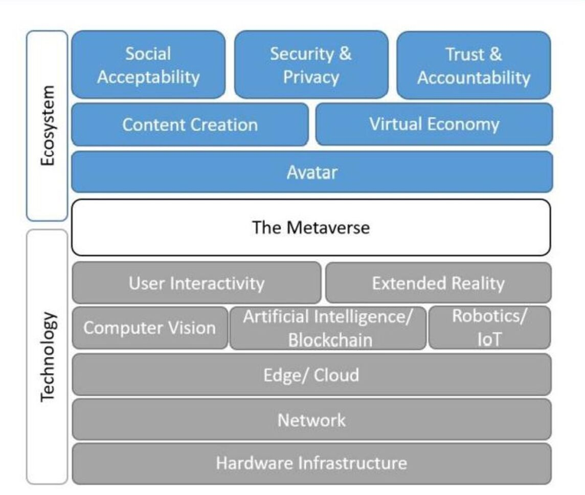
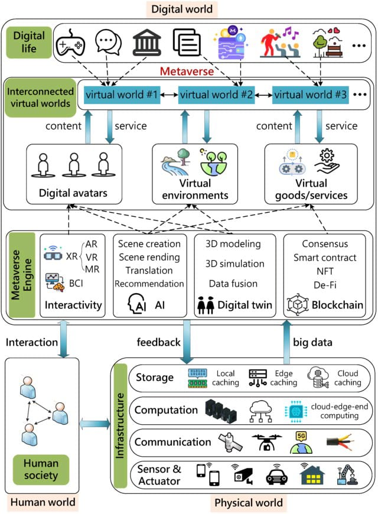
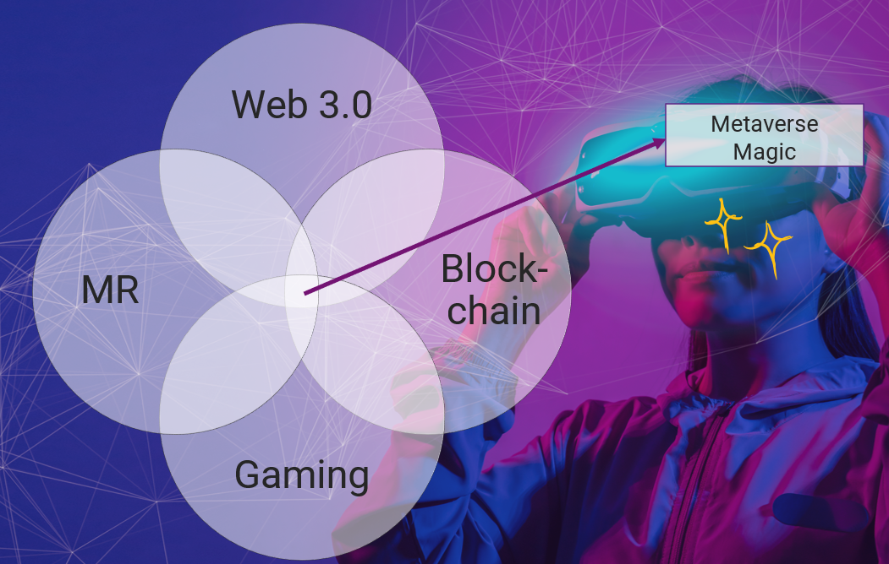
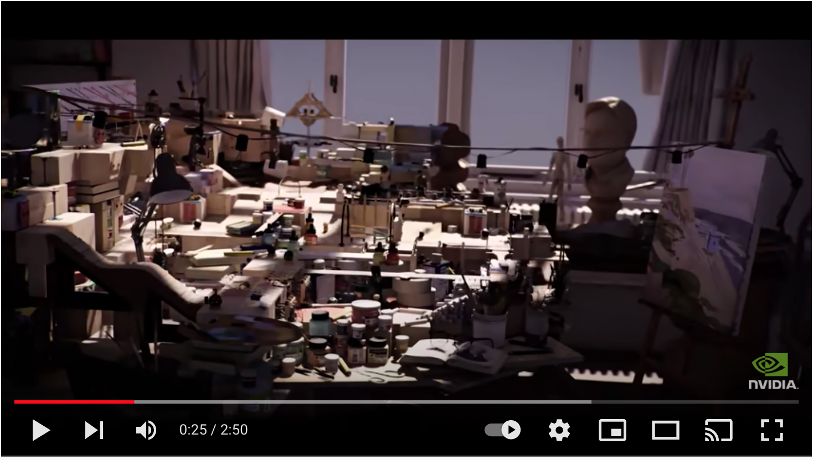
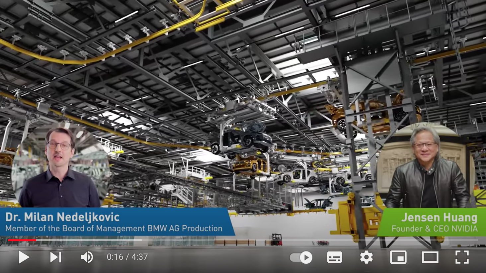

# Certified Web 3.0 and Metaverse Developer: A Nationwide Program in Karachi, Lahore, Islamabad, Peshawar, and Faisalabad

## [APPLY FOR ADMISSION NOW](https://www.piaic.org/) 

[Watch the Insane Future of Web 3.0 and Metaverse Video in Urdu](https://www.youtube.com/watch?v=eEz1rnmCfn4)

[JavaScript from Beginner to Professional: Learn JavaScript quickly by building fun, interactive, and dynamic web apps, games, and pages](https://www.amazon.com/JavaScript-Beginner-Professional-building-interactive/dp/1800562527/ref=sr_1_4)

[Study The Panaverse Plan](https://docs.google.com/presentation/d/12C1s4UBTlR9nZNEkRE6aAuGeRA3s92jx-8nJKo9jdH4/edit?usp=sharing)

## All Students Should Start Preparing For JavaScript Entry Test

All students are required to start learning JavaScript immediately, even before the program starts. If the number of students who apply for the program are greater than the seats available the applicants will be selected on the basis of JavaScript Quiz scores, which will be take at the start of classes. 

[Watch JavaScript by Zeeshan Hanif to prepare for the Entry Test](https://www.youtube.com/playlist?list=PLKvqnz8z1zWQdc0NSLknxmxBch5gLOqyo)

Note: You will asked to take a Javascript Entry Test at the start of classes.

## Outcome for Students

The students who graduate from this one-year program will be able to earn $50 per hour, to begin with. This will be a great opportunity for students and professionals of Pakistan. 

[Top 5 'Metaverse' jobs that will rule the future of tech industry](https://content.techgig.com/hiring/top-5-metaverse-jobs-that-will-rule-the-future-of-tech-industry/articleshow/87581325.cms)

[Blockchain Developer Salary - Jun 2022](https://web3.career/web3-salaries/blockchain-developer)

[Web3 Salaries Soar to $750,000 for Rank-and-File Devs](https://thedefiant.io/web3-soaring-salaries/)

[The Metaverse, Blockchain Gaming, and NFTs: Navigating the Internet’s Uncharted Waters](https://newzoo.com/insights/trend-reports/newzoo-report-on-metaverse-blockchain-gaming-nft-2022)

[How To Become Metaverse Developer: Scope, Skills, and Salary](https://www.blockchain-council.org/metaverse/how-to-become-metaverse-developer/)

## Panaverse Certified Web 3.0 and Metaverse Developer Tranining Program

The internet is undoubtedly the most significant technological development in human history. Although the industry has progressed immensely since its inception, we are just scratching the surface of what it can do for us. Web3 and metaverse technologies improves the internet as we know it today by adding innovative new features and enhancements. The metaverse reimagines the frontend, and web3 the backend of the web. Web 3.0 and the Metaverse will work together and complement each other in the future. Whereas Web 3.0 is primarily concerned with who will own and rule the internet of the future, the metaverse concept is concerned with how users will interact with it. When the metaverse world would come to fruition, it may be centralised (as in Web 2.0), decentralised (as in Web 3.0), or a hybrid of the two. In any case, it is likely that the world will be powered by NFTs (i.e. unique tokens).

Citi is the latest Wall Street firm to issue a bullish forecast for web3 and the metaverse, which describe a future internet vision based on decentralised technologies and virtual worlds. Citi said in a [research report published in March 2022](https://www.citivelocity.com/citigps/metaverse-and-money/) that the metaverse economy could have a <strong>total addressable market of up to $13 trillion and can capture five bullion users by 2030</strong>. We suggest you download the Citi's research report from [here](https://ir.citi.com/gps/x5%2BFQJT3BoHXVu9MsqVRoMdiws3RhL4yhF6Fr8us8oHaOe1W9smOy1%2B8aaAgT3SPuQVtwC5B2%2Fc%3D)

[Goldman Sachs Sees the Metaverse as $8 Trillion Opportunity.](https://news.bitcoin.com/goldman-sachs-metaverse-8-trillion-opportunity/) 

[Read the paper Opportunities in the metaverse by JP Morgan.](https://www.jpmorgan.com/content/dam/jpm/treasury-services/documents/opportunities-in-the-metaverse.pdf)  

[Tech Giants Create Metaverse Standards Forum for Software and Terminology Standards](https://www.coindesk.com/tech/2022/06/22/tech-giants-create-metaverse-standards-forum-for-software-and-terminology-standards/)

This program focuses on developing full-stack Web 3.0 and Metaverse experiences for the next generation of the internet by specializing in building worlds that merge the best of cutting-edge decentralized distributed blockchains with 3D metaverse client experiences (including Web 2.0 centralized serverless cloud technologies). 

After completing this program you will be able to develop 2D and 3D experiences that scale instantly to support even the most demanding applications, while at the same time delivering up to 90% cost savings. This stack which will be covered in this program is ideal for a broad set of applications. For example, enterprises that have hundreds of thousands of applications, or software as a service (SaaS) vendors that have multi-tenant environments with hundreds or thousands of databases, can use this stack across the entire enterprise both for 2D and 3D development.

The term metaverse is a combination of the Greek words meta, which means "beyond," "transcending," or "more comprehensive," and english word universe, which means "all existing matter and space." The options for entering virtual reality are limited to open and closed metaverses. Because there is no single, universal vision of a 3D virtual world on which everyone can agree, we believe the Metaverse will be made up of a number of open and closed ecosystems.

You can think of the stack which we will cover in this course in terms of layers. The first layer is the Web 2.0 technologies which provide the tools to develop 2D frontends and a highly sclable and cost effective cloud backend. The second layer is the Web 3.0 technolgies that is built using the first layer and the Ethererum blockchain. The third layer replaces the 2D frontends with 3D and XR technolgies for developing metaverse experiences. In the third layer we use all the backend technologies included in the first two layers, only the frontend changes. The third metaverse layer can be based on open and closed ecosystems. 

[Why You Should Learn Web 2.0 Before Getting into Web 3.0](https://javascript.plainenglish.io/why-you-should-learn-web-2-0-before-getting-into-web-3-0-d251625990db) 

The Web 2.0 full stack applicatios are build using these technologies, this is the first layer of our development stack:

1. [Typescript Programming Language for Front-end and Backend Development](https://www.typescriptlang.org/)
2. [Visual Studio Code Editor](https://code.visualstudio.com/)
3. [Front-end Web 2.0 Development Using Next.js](https://nextjs.org/)
4. [Infrastructure as Code using AWS Cloud Development Kit](https://aws.amazon.com/cdk/)
5. [AWS Lambda for Serverless Computing](https://aws.amazon.com/lambda/)
6. [Panacloud CLI for API Development](https://www.npmjs.com/package/@panacloud/cli)
7. [Amazon Aurora Serverless v2 PostgreSQL 13-compatible edition](https://docs.aws.amazon.com/AmazonRDS/latest/AuroraUserGuide/aurora-serverless-v2.html)

For more details check out the [Panacloud Web 2 Learning Repo](https://github.com/panacloud-modern-global-apps/nextjs) and [projects repo](https://github.com/panacloud-modern-global-apps/chakra-nextjs-projects)

This Web 2.0 stack can be easily extended to develop Web 3.0 Dapps using these technologies, this is the second layer:

1. [Ethereum Blockchain](https://ethereum.org/en/)
2. [Solidity Smart Contract Programming Language](https://docs.soliditylang.org/)
3. [OpenZepllin Smart Contracts](https://www.openzeppelin.com/contracts)
4. [Hardhat Ethereum Development Envirnoment](https://hardhat.org/)
5. [Ethers.js](https://docs.ethers.io/v5/)
6. [Metamask Wallet](https://metamask.io/)
7. [Alchemy](https://www.alchemy.com/)
8. [The Graph](https://thegraph.com/en/)
9. [Chainlink](https://chain.link/)
10. Panacloud Panaweb Web 3 Framework (Under development)

For more details check out the [Panacloud Web 3 Learning Repo](https://github.com/panacloud-modern-global-apps/dapps-nextjs) and [Smart Contract Learning Repo](https://github.com/panacloud-modern-global-apps/defi-dapps-solidity-smart-contracts)

The Web 2.0 and Web 3.0 layers can easily be extended to develop Metaverse experiences, which is the third layer in our stack. The backend will remain more less the same, the front-end will move towards 3D XR experiences from 2D user interfaces.

The metaverse development stack can be may be an open ecosystem with browser acting as a sort of operating system:

1. [WebGPU](https://www.w3.org/TR/webgpu/)
2. [WebXR](https://immersiveweb.dev/)
3. [Three.js](https://threejs.org/manual/#en/fundamentals)
4. [Webaverse](https://docs.webaverse.com/docs/index)

Currently, it seems that Apple, Meta, and Microsoft are going to introduce closed metaverse ecosystems. Unity 3D may be the best option to develop for these platforms: 

1. [Unity 3D XR Development Platform](https://docs.unity3d.com/Manual/XR.html)
2. [C# for Unity XR Programming](https://docs.unity3d.com/Manual/ScriptingSection.html)

The following concepts and technologies will also help us build the metaverse of tomorrow:

1. [UX for XR: User Experience Design and Strategies for Immersive Technologies (Design Thinking)](https://www.amazon.com/UX-Experience-Strategies-Immersive-Technologies/dp/1484270193/ref=sr_1_1)
2. [Brain-Computer Interfaces (BCI)](https://metaverse.acm.org/bci-for-interaction-with-metaverse/)
3. [AI In The Metaverse](https://www.forbes.com/sites/forbestechcouncil/2022/04/18/the-metaverse-driven-by-ai-along-with-the-old-fashioned-kind-of-intelligence/)
4. [Metaverse Avatar](https://metamandrill.com/metaverse-avatar/)
5. [Digital Twins](https://www.businessofapps.com/insights/how-does-the-digital-twin-and-metaverse-technologies-relate/)
6. [IoT and Metaverse](https://www.blockchain-council.org/metaverse/how-will-iot-integrate-the-real-world-with-the-metaverse/)

### Program Duration and Fee

The program will consist of four quarters. The fee will be Rs. 3,000 per quarter. Every week there a combination of onsite and online Zoom classes. Students will also watch recorded videos and study textbooks.

## Faculty Members

[Zia Khan](https://www.linkedin.com/in/ziaukhan/), Zeeshan Hanif, Asif Shah, Daniyal Nagori, Hira Khan, and [Khurram Shaikh](https://www.linkedin.com/in/khurram-shaikh-88524513/)

## Class Schedule

Karachi: Wednesday 6:00 pm - 10:00 pm, Bahria Auditorium Karsaz

Peshawar: Friday 3:00 pm - 7:00 pm, A number of Auditorium's under consideration

Islamabad: Saturday, National University of Technology (NUTEC) Auditorium and others

Lahore: Sunday, UMT Auditorium and others

Note: Those who do not live in the cities mentioned above should plan to travel to attend the class.

### Panaverse Community

[Join the Metaverse Discord Channel](https://discord.gg/GggDkBwJDr)

[Join the Metaverse Facebook Group](https://www.facebook.com/groups/metaverse.dev/)

### Books

[Download Books](https://github.com/rrizwan98/Web-3.0-Books)

## Program of Studies

The online program consists of four quarters listed below and will mainly be focused on imparting knowledge by training students to develop projects. The classes will mainly be taught on the weekends or after 6:00 pm (Pakistan Time) on weekdays so that everyone can attend. We will have main onsite classes supplemented by Zoom labs and recorded videos.

### Quarter I

[Quarter 1-A: Web 3.0 and Metaverse Theory](#quarter-1-b-object-oriented-programming-using-typescript)

[Quarter 1-B: Object Oriented Programming using Typescript](https://github.com/panaverse/panaverse.github.io/#quarter-1-b-object-oriented-programming-using-typescript)

[Quarter 1-C: C# Programming for Metaverse](#quarter-1-c-c-programming-for-metaverse)

### Quarter II

[Quarter II-A: Advanced Web 2.0 Development using Next.js](#quarter-ii-a-advanced-web-20-development-using-nextjs)

[Quarter II-B: Metaverse Development with Unity and C#](#quarter-ii-b-metaverse-development-with-unity-and-c)

[Quarter II-C: Smart Contract Development with Solidity and Hardhat for Metaverse Economy](#quarter-ii-c-smart-contract-development-with-solidity-and-hardhat-for-metaverse-economy)

### Quarter III

[Quarter III-A: Dapp Development using Ethers.js, Next.js, and Solidity](https://github.com/panaverse/panaverse.github.io/#quarter-iii-a-dapp-development-using-ethersjs-nextjs-and-solidity)

[Quarter III-B: Advanced Cross Platform Metaverse Development with Unity and C#](#quarter-iii-b-advanced-cross-platform-metaverse-development-with-unity-and-c)

[Quarter III-C: Serverless API Development](#quarter-iii-c-serverless-api-development)

### Quarter IV

[Quarter IV-A: Advanced Web 3.0 Development: DAO, Oracles, Graphs, DeFi and Tokenomics](#quarter-iv-a-advanced-web-30-development-dao-oracles-graphs-defi-and-tokenomics)

[Quarter IV-B: Computer Graphics Programming](#quarter-iv-b-computer-graphics-programming)

[Quarter IV-C: Designing and Developing Metaverse Dapp Experiences](#quarter-iv-c-designing-and-developing-metaverse-dapp-experiences)

## Program Details:

## Quarter 1-A: Web 3.0 and Metaverse Theory

[Metaverse: Open for business?](https://www.technologyreview.com/2022/06/27/1054974/metaverse-open-for-business/)

[Mastering Blockchain Book](https://www.packtpub.com/product/mastering-blockchain-third-edition/9781839213199)

[Download Mastering Blockchain Book](https://pk1lib.org/book/11269630/9409cf)

[The Metaverse Book](https://www.matthewball.vc/metaversebook)

[XR Design Principles and Best Practices](https://www.youtube.com/watch?v=TSu9SQ-hoCk)

Also refer to Appendix E for reading list

## Quarter 1-B: Object Oriented Programming using Typescript

The student should learn HTML, CSS, and Javascript by going through these videos:

[Learn HTML by Hira Khan](https://www.youtube.com/playlist?list=PLKvqnz8z1zWQ3BALy86tIXICkG874wAc6)

[Learn CSS Intro by Hira Khan](https://www.youtube.com/playlist?list=PLKvqnz8z1zWQSWIen_zUSEBmtqzPLuRob)

[Learn JavaScript by Zeeshan Hanif](https://www.youtube.com/playlist?list=PLKvqnz8z1zWQdc0NSLknxmxBch5gLOqyo)

We will cover the following in class:

[TypeScript and C# both were created by the same person named Anders Hejlsberg](https://dev.to/destrodevshow/typescript-and-c-both-created-by-the-same-person-named-anders-hejlsberg-42g4)

Chapters 2-6, 13 of [JavaScript from Beginner to Professional: Learn JavaScript quickly by building fun, interactive, and dynamic web apps, games, and pages](https://www.amazon.com/JavaScript-Beginner-Professional-building-interactive/dp/1800562527/ref=sr_1_4)

Chapters 1-11 of [Learning TypeScript: Enhance Your Web Development Skills Using Type-Safe JavaScript](https://www.amazon.com/Learning-TypeScript-Development-Type-Safe-JavaScript/dp/1098110331/ref=sr_1_1)

## Quarter 1-C: C# Programming for Metaverse

[Follow this Repo](https://github.com/panaverse/metaverse-dev/)

[Mono Project](https://www.mono-project.com/docs/)

[Unity Mono](https://docs.unity3d.com/2022.2/Documentation/Manual/Mono.html)

[The C# Player's Guide](https://www.amazon.com/C-Players-Guide-5th/dp/0985580151/ref=sr_1_1)

## Quarter II-A: Advanced Web 2.0 Development using Next.js

[WHAT IS NEXT JS AND WHY SHOULD YOU USE IT IN 2022?](https://pagepro.co/blog/what-is-nextjs/)

[Real-World Next.js](https://www.packtpub.com/product/real-world-next-js/9781801073493)

[Next.js Learning Repo](https://github.com/panacloud-modern-global-apps/nextjs)

## Quarter II-B: Metaverse Development with Unity and C#

[Learning C# by Developing Games with Unity 2021](https://www.amazon.com/Learning-Developing-Games-Unity-2021/dp/1801813949/ref=sr_1_1)

## Quarter II-C: Smart Contract Development with Solidity and Hardhat for Metaverse Economy

[Solidity Programming Essentials - Second Edition](https://www.packtpub.com/product/solidity-programming-essentials-second-edition/9781803231181)

[Solidity Learning Repo](https://github.com/panacloud-modern-global-apps/defi-dapps-solidity-smart-contracts)

### Class Videos

[Class 1: Steps 00 and 01: Blockchain, Ethereum Smart Contract, and Hardhat Intro in English on Facebook](https://www.facebook.com/fb.anees.ahmed/videos/611810023268930)

[Class 1: Steps 00 and 01: Blockchain, Ethereum Smart Contract, and Hardhat Intro in English on YouTube](https://youtu.be/24Nl4fVGH6g)

[Class 1: Step 00 and 01: Blockchain, Ethereum Smart Contract, and Hardhat Intro in Urdu on Facebook](https://www.facebook.com/Ai.SirQasim/videos/394282572468467)

[Class 1: Step 00 and 01: Blockchain, Ethereum Smart Contract, and Hardhat Intro in Urdu on YouTube](https://youtu.be/wXFi1wkn_5o)

[Class 2: Step 03 Part 1 - Solidity Tutorial in English on Facebook](https://web.facebook.com/trouble.maker121/videos/448321510117377)

[Class 2: Step 03 Part 1 - Solidity Tutorial in English on YouTube](https://youtu.be/NcZMDsjJ-OA)

[Class 2: Step 03 Part 1 - Solidity Tutorial in Urdu on Facebook](https://web.facebook.com/Ai.SirQasim/videos/322455473108467)

[Class 2: Step 03 Part 1 - Solidity Tutorial in Urdu on YouTube](https://youtu.be/rfnAsGNH14E)

[Class 3: Step 03 Part 2 - Solidity Tutorial in English on Facebook](https://web.facebook.com/fb.anees.ahmed/videos/7151001034909886)

[Class 3: Step 03 Part 2 - Solidity Tutorial in English on YouTube](https://youtu.be/mXuY7Sp5jmw)

[Class 3: Step 03 Part 2 - Solidity Tutorial in Urdu on Facebook](https://web.facebook.com/Ai.SirQasim/videos/2126325780860897)

[Class 3: Step 03 Part 2 - Solidity Tutorial in Urdu on YouTube](https://youtu.be/nhlchB7Mij4)

[Class 3 Part 2: Step 03 Part 2B - Solidity Tutorial in Urdu on YouTube](https://youtu.be/J3C9KGG61pA)

[Class 4: Step 03 Part 3 - Solidity Tutorial in English on Facebook](https://www.facebook.com/fb.anees.ahmed/videos/319111146832336)

[Class 4: Step 03 Part 3 - Solidity Tutorial in English on YouTube](https://youtu.be/t-8fHUpbjb8)

[Class 4: Step 03 Part 3 - Solidity Tutorial in Urdu on Facebook](https://www.facebook.com/Ai.SirQasim/videos/1812389385622735)

[Class 4: Step 03 Part 3 - Solidity Tutorial in Urdu on YouTube](https://youtu.be/nbG_FhoCLoE)

[Class 5: Step 03 Part 4 - Solidity Tutorial in English on Facebook](https://www.facebook.com/zeeshanhanif/videos/1378858009232147)

[Class 5: Step 03 Part 4 - Solidity Tutorial in English on YouTube](https://youtu.be/scga3Cy-NFQ)

[Class 5: Step 03 Part 4 - Solidity Tutorial in Urdu on Facebook](https://www.facebook.com/Ai.SirQasim/videos/495841945575417)

[Class 5: Step 03 Part 4 - Solidity Tutorial in Urdu on YouTube](https://youtu.be/Rq7q8ztRs70)

[Class 6: Step 03 Part 5 - Solidity Tutorial in English on Facebook](https://www.facebook.com/zeeshanhanif/videos/352545383194950)

[Class 6: Step 03 Part 5 - Solidity Tutorial in English on YouTube](https://youtu.be/56StWx7V4vM)

[Class 6: Step 03 Part 5 - Solidity Tutorial in Urdu on Facebook](https://www.facebook.com/Ai.SirQasim/videos/2210008845814579)

[Class 6: Step 03 Part 5 - Solidity Tutorial in Urdu on YouTube](https://youtu.be/lyQUb7vuvpY)

[Class 7: Step 03 Part 6 - Solidity Tutorial in English on Facebook](https://www.facebook.com/zeeshanhanif/videos/474397740982913)

[Class 7: Step 03 Part 6 - Solidity Tutorial in English on YouTube](https://youtu.be/dNel-1J7WAo)

[Class 7: Step 03 Part 6 - Solidity Tutorial in Urdu on Facebook](https://www.facebook.com/Ai.SirQasim/videos/1114838999266069)

[Class 7: Step 03 Part 6 - Solidity Tutorial in Urdu on YouTube](https://youtu.be/ynRJq88pJQo)

[Class 8: Step 04 - Chapter 02 Textbook in English on Facebook](https://www.facebook.com/zeeshanhanif/videos/480580873784502)

[Class 8: Step 04 - Chapter 02 Textbook in English on YouTube](https://youtu.be/eLxMxhfEZ9g)

[Class 8: Step 04 - Chapter 02 Textbook in Urdu on Facebook](https://www.facebook.com/Ai.SirQasim/videos/647528262963595)

[Class 8: Step 04 - Chapter 02 Textbook in Urdu on YouTube](https://youtu.be/HYgh3Nix7jQ)

[Class 9: Step 04 and 05 - Chapter 02 and 03 Textbook in English on Facebook](https://www.facebook.com/zeeshanhanif/videos/7014356888634818)

[Class 9: Step 04 and 05 - Chapter 02 and 03 Textbook in English on YouTube](https://youtu.be/zGvMRE6rflU)

[Class 9: Step 04 and 05  - Chapter 02 and 03 Textbook in Urdu on Facebook](https://www.facebook.com/Ai.SirQasim/videos/1050761768987494)

[Class 9: Step 04 and 05 - Chapter 02 and 03 Textbook in Urdu on YouTube](https://youtu.be/1DmqDVVv0Wg)

[Class 10: Step 6A - Chapter 07 Textbook in English on Facebook](https://www.facebook.com/zeeshanhanif/videos/1248604509216381)

[Class 10: SStep 6A - Chapter 07 Textbook in English on YouTube](https://youtu.be/rgEbkqhr-2g)

[Class 10: Step 6A - Chapter 07 Textbook in Urdu on Facebook](https://www.facebook.com/Ai.SirQasim/videos/703398320695153)

[Class 10: Step 6A - Chapter 07 Textbook in Urdu on YouTube](https://youtu.be/VFIItvWFfOY)

[Class 11: Step 6B - Vacation Project Assignment in English on Facebook](https://www.facebook.com/inampaki/videos/717989595995770)

[Class 11: SStep 6B - Vacation Project Assignment in English on YouTube](https://youtu.be/MXINU6LLC2A)

[Class 11: Step 6B - Vacation Project Assignment in Urdu on Facebook](https://www.facebook.com/Ai.SirQasim/videos/274105618254173)

[Class 11: Step 6B - Vacation Project Assignment in Urdu on YouTube](https://youtu.be/hLVxr-1seaA)

### Blockchain Project 1: Create a Token and Launch ICO/IEO/IDO

As you probably know, the ICO ("Initial Coin Offering") industry has been booming, and it's completely reinventing the way new startups kickstart themselves. In fact, go have a look at [Wikipedia's list of highest crowdfunding projects](https://en.wikipedia.org/wiki/List_of_highest-funded_crowdfunding_projects), and you'll notice that blockchain projects absolutely dominate the list.

[Understand the difference between IDO vs. IEO vs. ICO](https://phemex.com/blogs/what-is-a-dex-ido)

Also check these links for latest listings:

[ICO list at ICO Drops](https://icodrops.com/). 

[ICO List of Best New Initial Coin Offerings](https://topicolist.com/).

[Top-Rated Crypto Token Sales: List of New ICOs, STOs, IEOs and IDOsTop-Rated Crypto Token Sales: List of New ICOs, STOs, IEOs and IDOs](https://cryptototem.com/ico-list/)

[ICO List Online](https://www.icolistingonline.com/)

[Binance IEO List](https://coincodex.com/ieo-list/binance/)

[Binance Launchpad](https://www.coinspeaker.com/ieo/platform/binance-launchpad/)

[IEO List](https://icomarks.com/ieo)

[Polkastarter](https://polkastarter.com/)

Project Part 1: How to Launch a IEO on Binance Lauchpad

[Read how to Lauch an IEO](https://appinventiv.com/blog/how-to-launch-an-ieo/)

Your first task of the project is to make a google slides presentation on how to start a IEO on the [Binance Launch Pad](https://www.binance.com/en/support/faq/94ed108ce89d44ab8602aa3c476dfb04).

Note: Also document the alternatives to Binance Launchpad.

Project Part 2: How to Launch a IDO on Polkastarter

Review the [list of top fundraising platforms](https://cryptorank.io/fundraising-platforms)

Your second task of the project is to make a google slides presentation on how to start a IDO on the [Polkastarter](https://polkastarter.com/).

Project Part 3: Create a Pako Token

By creating an token and related contracts, you'll also learn how to handle money sent to to your contracts, which should come in handy if you want to create some kind of paid decentralised service in the future.

Therefore, for the sake of this chapter, let's imagine that our  Pako DApp uses its own coin – the Pako Token. We will create two contracts – one for the token itself and one for the token crowd sale (the ICO).

Now Create your own Pako ERC20 Token and deploy it on a testnet. The Token should be to use openzeppelin contracts. You will use Harkhat development envirnoment. Also, write at least 20 automated tests. We will be using the Solidity and Typescript for dvelopment.

Project Part 4: Develop Crowd Sale Contract

This contract will be responsible to allow users to exchange ETH for our Pako Token. In order to do that we need to
Set a price for our token (1 ETH = 100 Pako Token)

Implement a payable buyToken() function. 

Emit a BuyTokens event that will log who’s the buyer, the amount of ETH sent and the amount of Token bought

Transfer 75% the Tokens to the Crowd Sale contract at deployment time. i.e. Right after the contract is deployed, we want the token contract to send 75% of our token supply to it. While 25% remain in our personal "owner" account.

Transfer the ownership of the Crowd Sale contract (at deploy time) to our frontend address so that we are able to withdraw the ETH.

You can use the [openzeppelin crowd sale contracts](https://docs.openzeppelin.com/contracts/4.x/crowdsales), however you will have to update the code to the latest solidity version.

Also write exentisive tests, for example we will simply send a transaction of 1 ETH from a random account to the contract. After the transaction, we should expect the account to have received Pako, while the contract's balance should have been reduced.

Note: Before you get started writing the token contract we suggest you review [access control](https://docs.openzeppelin.com/contracts/4.x/access-control).

Project Part 5: Trying it with MetaMask

While it's always good to test your code, it's often more satisfying to see the results of your work wrapped in a nice UI. Let's see how we can deploy our contracts and get some Pako tokens into our MetaMask wallet!

We start by running our deployment scripts for the test network so that the new token contracts are uploaded and deployed.

When it's done, take note of what addresses the contracts was uploaded to and copy it!

Now head to MetaMask, and send a transaction of 1 ETH to the crowd sale contract address. If your MetaMask wallet doesn't have any ethers, remember that you can use any faucet.

After the transaction has confirmed, you might be confused about why you can't see any tokens in your wallet. It turns out that you need to manually add the token address in MetaMask in order to "register" it – after all, there are so many tokens out there, there's no way MetaMask could list them all by default!

To do this, open the side menu and click on the "Add token" button to get started:

Once you're on the token page, click on "Add custom token" and paste in the token contract's address in the address field.

After confirming that you want to add the token, you should be able to see your Pako balance right next to your ETH balance in the wallet. How cool!

Project Part 6: Trying it with Multisignature Wallets

[Read](https://www.coindesk.com/tech/2020/11/10/multisignature-wallets-can-keep-your-coins-safer-if-you-use-them-right/)

Now use [Gnosis Safe]{https://gnosis-safe.io/) with multi-sigs to do what you did in the last part.

Project Part 7: Sending Tokens using Ethers.js 

Write a Typescript program to send Pako Token to some friend's address using Ethers.js.

[You may follow this tutorial](https://ethereum.org/en/developers/tutorials/send-token-etherjs/)

Project Part 8 Advance: Create, Deploy, Mint, and Sell a NFT

[Read this NFT tutorial series](https://ethereum.org/en/developers/tutorials/how-to-write-and-deploy-an-nft/)

Create a NFT contract using the [OpenZepplen ERC721 NFT Standard](https://docs.openzeppelin.com/contracts/4.x/erc721).

You may use the [Preset ERC721 contract](https://docs.openzeppelin.com/contracts/4.x/erc721#Presets).

Deploy your NFT contract on a testnet, mint it, and view it on the MetaMask wallet and list it on [OpenSea Marketplace](https://opensea.io/) for sale.

[Implement a ERC721 Market](https://ethereum.org/en/developers/tutorials/how-to-implement-an-erc721-market/)

## Quarter III-A: Dapp Development using Ethers.js, Next.js, and Solidity

[Ethers](https://docs.ethers.io/v5/)

[Panaweb](https://github.com/panacloud/panaweb)

## Quarter III-B: Advanced Cross Platform Metaverse Development with Unity and C#

[Mind-Melding Unity and Blender for 3D Game Development](https://www.packtpub.com/product/mind-melding-unity-and-blender-for-3d-game-development/9781801071550)

[OpenXR](https://en.wikipedia.org/wiki/OpenXR)

[The time to embrace OpenXR is now](https://www.linkedin.com/pulse/time-embrace-openxr-now-ivana-tilca/)

[Oculus is “All in on OpenXR,” New Developer Features Will Come to OpenXR Only](https://www.roadtovr.com/oculus-openxr-shift-unity-unreal-engine/)

[Unity OpenXR Plugin](https://docs.unity3d.com/Packages/com.unity.xr.openxr@1.3/manual/index.html)

## Quarter III-C: Serverless API Development 

[Expert Advice on Moving to Serverless](https://dashbird.io/blog/expert-advice-moving-to-serverless/)

[Going Serverless with 7 Core AWS Services](https://levelup.gitconnected.com/going-serverless-with-7-core-aws-services-fcbd063985cd)

We will be writing Infrastructure as Code (IaC) CDK AWS Serverless constructs in TypeScript:

[Working with CDK V2](https://docs.aws.amazon.com/cdk/latest/guide/work-with-cdk-v2.html)

[Getting Started with CDK](https://docs.aws.amazon.com/cdk/latest/guide/getting_started.html)

## Quarter IV-A: Advanced Web 3.0 Development: DAO, Oracles, Graphs, DeFi and Tokenomics

[DAO](https://ethereum.org/en/dao/)

[The Graph](https://thegraph.com/en/)

[Chainlink](https://chain.link/)

[DeFi and the Future of Finance](https://www.amazon.com/DeFi-Future-Finance-Campbell-Harvey/dp/1119836018/ref=sr_1_1)

[Tokenomics](https://coinmarketcap.com/alexandria/article/what-is-tokenomics)

## Quarter IV-B: Computer Graphics Programming

[A Very Gentle Introduction to Computer Graphics Programming](https://www.scratchapixel.com/lessons/3d-basic-rendering/get-started)

[Computer Graphics Textbook: Computer Graphics from Scratch - A Programmer's Introduction to 3D Rendering](https://www.amazon.com/Computer-Graphics-Scratch-Gabriel-Gambetta/dp/1718500769/ref=sr_1_9)

[Basic Math for Game Development with Unity 3D: A Beginner's Guide to Mathematical Foundations](https://www.amazon.com/Basic-Math-Game-Development-Unity/dp/1484254422/ref=sr_1_fkmr0_1)

[Math for Programmers: 3D graphics, machine learning, and simulations with Python](https://www.amazon.com/Math-Programmers-Paul-Orland/dp/1617295353/ref=sr_1_1)

## Quarter IV-C: Designing and Developing Metaverse Dapp Experiences

[HOW TO BUILD A METAVERSE DAPP WITH UNITY](https://www.leewayhertz.com/metaverse-unity-development/)

[Designing XR Textbook: Designing Immersive 3D Experiences - A Designer's Guide to Creating Realistic 3D Experiences for Extended Reality](https://www.amazon.com/Designing-Immersive-Experiences-Designers-Realistic/dp/0137282834/ref=sr_1_8)

[UX for XR: User Experience Design and Strategies for Immersive Technologies (Design Thinking)](https://www.amazon.com/UX-Experience-Strategies-Immersive-Technologies/dp/1484270193/ref=sr_1_1)

## Appendix

## Appendix A: Key Concepts

## Web 3.0

[Web 3.0](https://medium.com/fabric-ventures/what-is-web-3-0-why-it-matters-934eb07f3d2b) is a concept for the internet's next generation. It is the evolution of user control and ownership over their creations and online content, digital assets, and online identities. Users in Web 3.0 can create content while owning, controlling, and monetizing it through the use of blockchain and cryptocurrencies.

## Metaverse

While precise definitions are difficult to come by, the metaverse is generally thought to be a network of 3-D virtual worlds where people can interact, conduct business, and form social connections using their virtual "avatars." Consider it a virtual reality version of today's internet.

The definition of the metaverse extends beyond virtual worlds such as gaming and virtual reality applications. The broader vision of the metaverse includes smart manufacturing technology, virtual advertising, online events such as concerts, and digital currencies such as Ethereum.

## Serverless Cloud Computing

Web2 centralized serverless cloud technologies will also play a major role on the internet in the short to medium term until Web3 technologies mature and totally replace web2 technologies. 

### Web3 Metaverse: Decentraland and Sandbox on Ethereum

The most popular Metaverse projects at the moment are Decentraland (MANA) and The Sandbox (SAND), which provide virtual worlds where users can interact, buy land via an Ethereum smart contract, and live in an alternate reality. Both operate entirely on the Ethereum blockchain and allow users to buy real estate and build properties with cryptocurrencies, with SAND offering user-generated content that gives it limitless creative power. Panaverse will cover these projects in depth. 

To provide Web 3 functionality we will use the [Ethereum](https://ethereum.org/en/) blockchain and [Solidity](https://docs.soliditylang.org/en/v0.8.13/) programming language for smart contract development. 

### The AR Glasses: Apple AR Glasses

As discussed in detail in this [article](https://www.computerworld.com/article/3654197/enterprise-ar-will-be-dominated-by-apple-and-magic-leap.html) we also believe that Apple will lead the AR and Metaverse space on the glasses side. There [M1 processors](https://en.wikipedia.org/wiki/Apple_M1) are the most efficient processors in the world. Some derivative of the M1 will power the Apple AR glasses. Apple's [ARKit](https://developer.apple.com/augmented-reality/arkit/) is also quite mature. Apple's [Swift](https://developer.apple.com/swift/) programming language is extremely powerfull. The combination of the hardware and the software stacks will be extremely difficult to beat in the next few years. The main competetors Nvidia, Microsoft, Meta, Amazon, and Google are three to five years behind right now. As developers the only down side is going to be the total lock-in.  

### Cloud Computing: AWS Serverless Computing

On the backend in the medium term Web3 technologies will be complemented by Web2 [AWS Serverless](https://aws.amazon.com/serverless/) Cloud combined with [AWS CDK](https://aws.amazon.com/cdk/) will provide an extremely scalable platform, with Typescript as the programming language of choice.

## Appendix B: Apple’s Augmented Reality ARKit and USDz Development

[Swift Programming: The Big Nerd Ranch Guide](https://www.amazon.com/Swift-Programming-Ranch-Guide-Guides/dp/0135264200/ref=sr_1_1)

[Mastering ARKit: Apple’s Augmented Reality App Development Platform](https://www.amazon.com/Mastering-ARKit-Augmented-Development-Platform-ebook/dp/B09TDKXFK6/ref=sr_1_1)

3D File Formats

[Going 3D -> glTF, USD, USDz -> Let's Break These File Formats Down](https://www.linkedin.com/pulse/going-3d-file-formats-lets-break-down-4d-pipeline/)

[gltf vs USD](https://news.ycombinator.com/item?id=22336361)

## Appendix C: 3D Simulation and Design collaboration with Omniverse, Universal Scene Description (USD) and Python

### Part 1: Python

[Python Crash Course, 2nd Edition: A Hands-On, Project-Based Introduction to Programming](https://www.amazon.com/Python-Crash-Course-2nd-Edition/dp/1593279280/ref=sr_1_1)

### Part 2: Pixar's Universal Scene Description (USD)

Universal Scene Description (USD) is an open source framework developed by Pixar for exchanging 3D computer graphics data across different applications. It is designed to be flexible and extensible to other collaborative environments that run interconnected tools, such as NVIDIA Omniverse. More than a dozen companies from Apple, Nvidia, Adobe, to Unity support USD. The standard is on the cusp of becoming the solder that fuses all sorts of virtual and physical worlds into a metaverse.

[Five Things to Know About USD](https://www.youtube.com/watch?v=vFxytzQlOEs)

[To 3D and Beyond: Pixar’s USD Coming to an Industry Near You](https://blogs.nvidia.com/blog/2020/10/05/usd-ecosystem-omniverse/)

[Watch Introduction to Pixar's Universal Scene Description](https://www.youtube.com/watch?v=LHoHUT1telk)

[What is USD: A Primer](https://www.youtube.com/watch?v=Yp_TRVD3wjQ)

[OMNIVERSE DEVELOPER RESOURCE CENTER](https://developer.nvidia.com/nvidia-omniverse-developer-resource-center)

[Python Crash Course, 2nd Edition: A Hands-On, Project-Based Introduction to Programming](https://www.amazon.com/Python-Crash-Course-2nd-Edition/dp/1593279280/ref=sr_1_1)

[Assignment: Developing a Tetris game with PixarUSD and Python Scripting in Omniverse Kit](https://www.youtube.com/watch?v=nF_bue13vNc)

[Plumbing for the Metaverse with Universal Scene Description (USD)](https://medium.com/@nvidiaomniverse/plumbing-for-the-metaverse-with-universal-scene-description-usd-856a863d9b12)

[It started at Pixar. Now it's the Apple-backed 3D file format viewed as HTML of metaverse](https://www.theregister.com/2021/11/10/usd_3d_format/)

[USD at Nvidia](https://developer.nvidia.com/usd)

[USD Official Docs](https://graphics.pixar.com/usd/release/index.html)

[USD Tutorials](https://graphics.pixar.com/usd/dev/tut_usd_tutorials.html)

[Getting Started with USD for Collaborative 3D Workflows](https://courses.nvidia.com/courses/course-v1:DLI+S-FX-02+V1/about)

Outline
Introduction

Overview of Pixar USD features and components

Understanding the USD composition

Preparing the Development Environment

Building and installing dependencies and components

Setting the environment variables for Python

Authoring USD

Creating a USD stage

Creating and editing prims

Referencing layers

Converting layers into different USD file formats

Traversing prims in a stage

Creating and editing variants

Applying transformations, animations, layer offsets, and shading

Working with Plugins and Examples

Modifying variant examples in Blender

Generating USD assets from Blender

Modifying USD scenes with Blender

Setting up and using Usdview plugin

Building schema classes

### Part 3: Omniverse

[OMNIVERSE DEVELOPER RESOURCE CENTER](https://developer.nvidia.com/nvidia-omniverse-developer-resource-center)

[Assignment: Developing a Tetris game with PixarUSD and Python Scripting in Omniverse Kit](https://www.youtube.com/watch?v=nF_bue13vNc)

## Appendix D: Metaverse Major Players

### Nvidia

[NVIDIA Makes Free Version of Omniverse Available to Millions of Individual Creators and Artists Worldwide](https://blogs.nvidia.com/blog/2022/01/04/omniverse-available-free-to-creators/)

[Nvidia Announces Expansion of Omniverse to Consumer Internet](https://thenewstack.io/nvidia-announces-expansion-of-omniverse-to-consumer-internet/)

### Decentraland

[How to get started in the Metaverse? Decentraland Tutorial](https://www.youtube.com/watch?v=z5-QaCq9mh8)

[The Metaverse Land Rush Is an Illusion](https://www.wired.com/story/metaverse-land-rush-illusion/)

### Sandbox

[The Sandbox Tutorial](https://token-information.com/instruction-tutorial-for-metaverse-game-the-sandbox/)

[The Sandbox Vs Decentraland: Which Metaverse Is The Best?](https://stealthoptional.com/metaverse/the-sandbox-vs-decentraland/)

[The Sandbox vs Decentraland — Where Should You Set Your Bets](https://medium.datadriveninvestor.com/the-sandbox-vs-decentraland-where-should-you-set-your-bets-3b80785b985b)

### Meta

[We can now explore Meta’s first virtual world](https://bigthink.com/the-future/meta-virtual-world/)

[Horizon Worlds](https://www.oculus.com/experiences/quest/2532035600194083/)

[Project Cambria: Release Date, Latest News, Leaks, And More](https://www.gfinityesports.com/tech/project-cambria-oculus-release-date/)

### Apple

[Apple AR Headset: Release Date, Rumours And Latest News](https://www.gfinityesports.com/vr/apple-ar-headset-release-date-news-price-specs/)

### Roblox

[Roblox’s metaverse is already here, and it’s wildly popular](https://www.morningbrew.com/emerging-tech/stories/2021/12/10/roblox-s-metaverse-is-already-here-and-it-s-wildly-popular)

[Roblox Website](https://www.roblox.com/)

### Unity

[We’re the underlying tool set for creating the metaverse, Unity CEO says](https://www.cnbc.com/video/2021/11/10/were-the-underlying-tool-set-for-creating-the-metaverse-unity-ceo-says.html)

[Unity is buying VFX giant Weta Digital in preparation for the metaverse boom](https://www.notebookcheck.net/Unity-is-buying-VFX-giant-Weta-Digital-in-preparation-for-the-metaverse-boom.578155.0.html)

[Why Unity scooped up Weta Digital’s 3D tools for $1.6B](https://venturebeat.com/2021/11/14/why-unity-scooped-up-weta-digitals-3d-tools-for-1-6b/)

[Unity's Weta acquisition doesn't need the Metaverse to make sense](https://www.gamesindustry.biz/articles/2021-11-12-unitys-weta-acquisition-doesnt-need-the-metaverse-to-make-sense-opinion)

[Unity and USD](https://docs.unity3d.com/Manual/com.unity.formats.usd.html)

## Appendix E: Web3 and Metaverse Introduction and Theory

[Video: What Is The Difference Between Web3 And The Metaverse?](https://www.youtube.com/watch?v=BCr6XxOd9eE)

[Citi research report published in March 2022](https://www.citivelocity.com/citigps/metaverse-and-money/) 

[The Metaverse: And How it Will Revolutionize Everything](https://www.amazon.com/Metaverse-How-Will-Revolutionize-Everything/dp/1324092033/ref=sr_1_4)

[The Metaverse: Prepare Now For the Next Big Thing!](https://www.amazon.com/Metaverse-Prepare-Now-Next-Thing/dp/B09DMRF373/ref=pd_sbs_1/132-9505128-5572430)

Watch these videos to Understand the level 3D Graphics Technology has reached

#### What is Metaverse

[What’s All the Hype About the Metaverse?](https://www.nytimes.com/2022/01/18/technology/personaltech/metaverse-gaming-definition.html)

[The Metaverse Has Already Arrived. Here’s What That Actually Means](https://time.com/6116826/what-is-the-metaverse/)

[Explainer: What is the 'metaverse'?](https://www.youtube.com/watch?v=99BnZ8js1_k)

[The new metaverse gold rush](https://www.youtube.com/watch?v=8zbQhb2siHs)

[The Metaverse could be a problem](https://www.youtube.com/watch?v=RgJwPco3wew)

[Facebook, Walmart and How Companies Shouldn’t Set Up in the Metaverse](https://www.coindesk.com/layer2/2022/01/05/facebook-walmart-and-how-companies-shouldnt-set-up-in-the-metaverse/)

[How Metaverse Works? Secrets of Metaverse Explained in Hindi](https://www.youtube.com/watch?v=0azMpBagjI4)

#### Metaverse is the Future

[Nvidia CEO: The metaverse will be 'much, much bigger than the physical world'](https://finance.yahoo.com/news/nvidia-ceo-the-metaverse-will-be-much-much-bigger-than-the-physical-world-174256652.html)

[3 Stocks to Buy With a $30 Trillion Metaverse Market on the Way](https://www.fool.com/investing/2021/12/06/3-stocks-to-buy-with-a-30-trillion-metaverse-marke/)

The Information estimates that the metaverse could be worth about [$82B by 2025](https://www.theinformation.com/articles/what-will-metaverse-be-worth-in-2025-our-guess-is-82-billion)

[The Metaverse Is Coming And It’s A Very Big Deal](https://www.forbes.com/sites/cathyhackl/2020/07/05/the-metaverse-is-coming--its-a-very-big-deal/?sh=3c6ee273440f)

#### The Players and the Development Platforms

[What the Metaverse Means for Developers](https://thenewstack.io/metaverse-developers/)

[Nvidia Omniverse vs Facebook Metaverse](https://www.youtube.com/watch?v=fVaDO8ek57Q)

[What is Microsoft's Metaverse?](https://www.youtube.com/watch?v=Qw6UCwCt4bE)

[Microsoft and Nvidia are working on their own more practical metaverse](https://www.techspot.com/news/92064-microsoft-nvidia-working-their-own-more-practical-metaverse.html)

[The Key To Unlocking The Metaverse Is Nvidia’s Omniverse](https://www.techspot.com/news/92064-microsoft-nvidia-working-their-own-more-practical-metaverse.html)

[Clash of the Metaverse Titans: Microsoft, Meta and Apple](https://medium.com/building-the-metaverse/clash-of-the-metaverse-titans-microsoft-meta-and-apple-ce505b010376)

[Metaverse… Closer Than You Think](https://croftgroup.com/metaverse-closer-than-you-think/)

#### What Web3?

[Video: What is Web3 with Examples?](https://www.youtube.com/watch?v=WEsO8OuAnjE)

[Video: What is Web3?](https://www.youtube.com/watch?v=nHhAEkG1y2U)

#### Metaverse and Web3

[WEB 3.0 VS METAVERSE: SIMILARITIES AND DIFFERENCES YOU NEED TO KNOW IN 2022](https://www.analyticsinsight.net/web-3-0-vs-metaverse-similarities-and-differences-you-need-to-know-in-2022/)

[Goldman Sachs Says Blockchain Is Key to Metaverse and Web 3 Development](https://www.coindesk.com/business/2021/12/17/goldman-sachs-says-blockchain-is-key-to-metaverse-and-web-3-development/)

[Web 3.0 vs. Metaverse: similarities and differences](https://experty.io/web-3-0-vs-metaverse-similarities-and-differences)

[Metaverse Explained In 10 Mins I Why Will Web3 Be A 100x Opportunity?](https://www.youtube.com/watch?v=hAkbAqVpII0)

[Why NFTs Are The Keys To Accessing The Metaverse](https://www.binance.com/en/blog/nft/why-nfts-are-the-keys-to-accessing-the-metaverse-421499824684903085)

[Metaverse, NFT, And DeFi: Here's Why They Matter In The Blockchain World](https://www.ndtv.com/business/metaverse-nft-and-defi-heres-why-they-matter-in-the-blockchain-world-2654667)

[MetaFi: DeFi for the Metaverse](https://outlierventures.io/research/metafi-defi-for-the-metaverse/)

#### Creator Economy of the Metaverse

[Creator Economy of the Metaverse - Roblox, Unity, Unreal and more!](https://www.youtube.com/watch?v=VLwqivmWM_I)

[Evolution of the Creator Economy](https://medium.com/building-the-metaverse/evolution-of-the-creator-economy-9e038e8411af)

[How to Get Paid in the Metaverse Creator Economy Today](https://hackernoon.com/how-to-get-paid-in-the-metaverse-creator-economy-today)

#### Metaverse in the Enterprise

[7 ways the metaverse will change the enterprise](https://venturebeat.com/2022/01/26/7-ways-the-metaverse-will-change-the-enterprise/)

[How the metaverse will let you simulate everything](https://venturebeat.com/2022/01/26/omniverse-ability-to-simulate-anything-self-driving-cars-energy-power-consumption/)

#### Challenges of Metaverse that Needs to be Solved

[The DeanBeat: The problem of the sniper and the metaverse](https://venturebeat.com/2022/01/14/the-deanbeat-the-problem-of-the-sniper-and-the-metaverse/amp/)

[7 Challenges of The Metaverse](https://lucidrealitylabs.com/blog/7-challenges-of-the-metaverse)

### Assignment 1:

Read and Understand the above articles

### Assignment 2:

Make a Metaverse presentation from the Articles you have read in Assignment 1 using Google slides. 
Please Donot share the slides with anyone except me, until I instruct you to do so.

Five reasons we are doing this:

1. When making something we remember
2. To make a summary of the material
3. To teach others from this material
4. Have reference material for ourselves
5. To see who are the leaders and best workers in this group

## Appendix E: Blender 3D Graphics

Blender development is being funded by heavyweights in the real-time 3D (RT3D) space such as Apple, Unity, AMD, Intel, Meta, NVIDIA, AWS, Epic Games, Adobe, Microsoft, and Decentraland. It is expected to become the standard asset creation tool for metaverse. 

[Blender 3.0+ Download](https://www.blender.org/download/)

[Blender 3.0 Beginner Tutorial](https://www.youtube.com/playlist?list=PLjEaoINr3zgFX8ZsChQVQsuDSjEqdWMAD)

[Blender 3.0 Hotkey](https://docs.google.com/document/d/1zPBgZAdftWa6WVa7UIFUqW_7EcqOYE0X743RqFuJL3o/edit)

[Blender Projects Textbook: Blender by Example 2nd Edition](https://www.packtpub.com/product/blender-3d-by-example-second-edition/9781789612561)

[Blender Textbook: The Complete Guide to Blender Graphics: Computer Modeling & Animation 7th Edition by John M. Blain](https://www.amazon.com/Complete-Guide-Blender-Graphics-Animation/dp/103212167X/ref=sr_1_5)

[Best Hardware Performance for Blender Rendering](https://www.youtube.com/watch?v=H7T0SzdFHwg)

### Assignment 3:

Build a 3D Donut using Blender 3 as shown in these [video tutorials](https://www.youtube.com/playlist?list=PLjEaoINr3zgFX8ZsChQVQsuDSjEqdWMAD).

### Assignment 4:

Build a 3D Sword in the Stone using Blender 3 as shown in these [video tutorials](https://www.youtube.com/watch?v=bpvh-9H8S1g)

### Assignment 5:

Build a Viking Scene using Blender 3 as shown in chapter 2 of the Book [Blender by Example 2nd Edition](https://www.packtpub.com/product/blender-3d-by-example-second-edition/9781789612561)

### Assignment 6:

Modeling a Time Machine using Blender 3 as shown in chapters 3 and 4 of the Book [Blender by Example 2nd Edition](https://www.packtpub.com/product/blender-3d-by-example-second-edition/9781789612561)

### Assignment 7:

Build a Modern Kitchen using Blender 3 as shown in chapters 5, 6, and 7 of the Book [Blender by Example 2nd Edition](https://www.packtpub.com/product/blender-3d-by-example-second-edition/9781789612561)

### Assignment 8:

Illustrating an Alien Hero with Grease Pencil as shown in chapter 8 of the Book [Blender by Example 2nd Edition](https://www.packtpub.com/product/blender-3d-by-example-second-edition/9781789612561)

